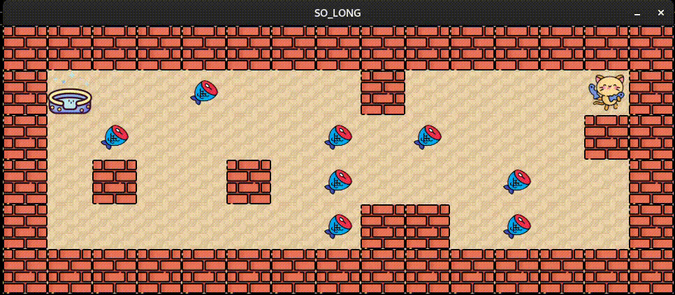

# 🐱 42 Paris - So Long: A Cat's Escape Adventure! 🌍🎮
## 🚀 Project overview

So Long is a small 2D game where the player controls a character 🐱 who must collect items 🐟 and find the exit 🧺 on a map. Initially themed as a dolphin escaping Earth after eating fish, you can customize it with any character, collectibles, and world.

The aim is to learn how to manage textures and basic gameplay mechanics using the MiniLibX graphical library.

## 🗝️ Key concepts

**MiniLibX**: A graphical library used to create a window, display images, and handle events (keyboard and mouse).

**2D Game Design**: Manage a character that moves on a map, collects items, and exits through the correct path.

**Event Handling**: The game responds to player input, such as movement via the keyboard and window interactions.
## ⚙️ Program execution

The program is executed with the following format: `$> ./so_long map.ber`

**Example Maps**:
A valid .ber file might look like this:
|   |   |   |   |   |   |   |   |   |   |   |   |   |
|---|---|---|---|---|---|---|---|---|---|---|---|---|
| 1 | 1 | 1 | 1 | 1 | 1 | 1 | 1 | 1 | 1 | 1 | 1 | 1 |
| 1 | E | 0 | 1 | 0 | 0 | 0 | 0 | 0 | 0 | C | 1 | 1 |
| 1 | 0 | 0 | 0 | 1 | 1 | 1 | 1 | 1 | 0 | 0 | 1 | 1 |
| 1 | P | 0 | 0 | 1 | 1 | 0 | 0 | 0 | 0 | 0 | 1 | 1 |
| 1 | 1 | 1 | 1 | 1 | 1 | 1 | 1 | 1 | 1 | 1 | 1 | 1 |

Where:

- **1**: Wall
- **0**: Empty space
- **C**: Collectible
- **E**: Exit
- **P**: Player's starting position

**Game Objectives**:
- The player must collect all collectibles (C) and reach the exit (E).
- The game displays the number of movements in the terminal.
- The player moves with the keys W, A, S, D or arrow keys (or optionally ZQSD).

🎮 **Game Features**:
- Top-down or Profile 2D View.
- Non-real-time gameplay: moves are turn-based and there is no time limit to complete actions.

**Basic Controls**:
- **W/A/S/D**: Move up, left, down, and right.
- **ESC** or ❌ : Quit the game.

## 🖥️ Project requirements

- **Map Parsing**: The game reads and validates a map from a .ber file.
- **Graphic Management**: The game must display the map and character movements in a window.
- The window must handle resizing and minimizing smoothly.
- Pressing ESC or clicking the window's close button should exit the game cleanly.
- **Error Handling**: If the map is invalid (e.g., missing walls, incorrect format), the program must display an error and exit cleanly.
- **Memory Management**: Avoid memory leaks and use free when necessary.
- **Bonus**: Display the movement count directly on screen instead of writing it in the shell.

🛠️ **Project Files**:
- **Makefile**: Compiles LIBFT and MINILBX-linux (to be added, a version for mac exists)
- **Map files**: .ber maps used to define and test the game environment.
- **Textures**: Custom images for walls, collectibles, and player.
## Demo

